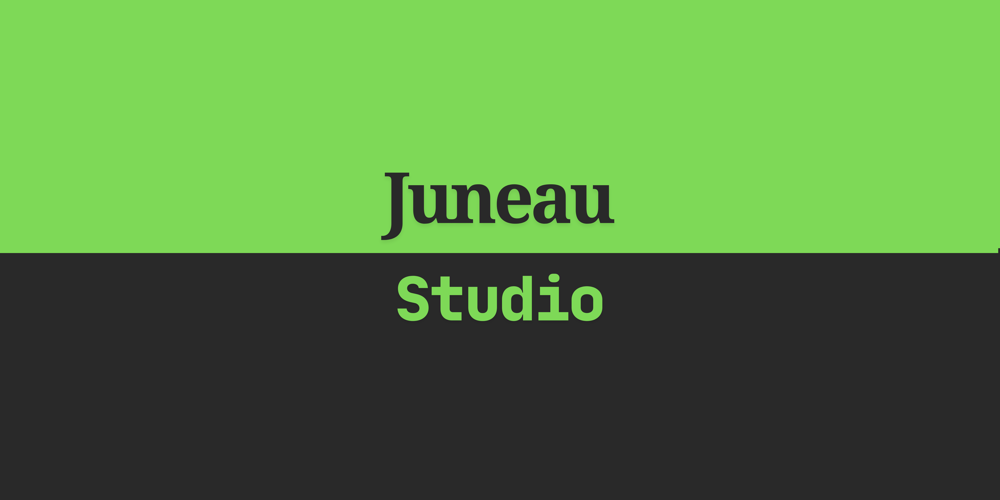

## Luc Juneau - Software Developer

Hi, I'm Luc Juneau. I am a Full Stack Software Developer, and proud local of Knoxville, Tennessee. 
I found my passion for Software Development in Middle School, when I would make silly mods for me and my friends in Terraria. Through Highschool I took classes in Software Development, growing further in my skills with HTML, CSS, and JavaScript. It was then I decided that I wanted to become a Web Developer, and after High School I went to Nashville Software School where I studied Full-Time in an intense six-month course. There I learned the depths of the field, all the way from HMTL to React.js to ASP.NET C# to PostgreSQL to Ubuntu and Server Hosting. It was an incredible learning experience and I never would be as capable as I am today without it. Now I work as a Full-Time Software QA, but my creative dreams still live on through my many projects I keep alive. Mainly my proudest piece of software - Hearth, a personal finance management application.

  - What I'm Building   🛠️: A Personal Finance & Life Management Application called Hearth.
  - How To Contact      📞: ( 865-888-6218 ) or ( kxtnluc@gmail.com )
  - Where to see more   🔭: https://juneaustudio.com
